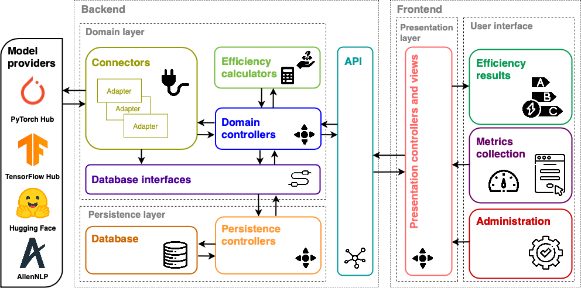

[](https://doi.org/10.5281/zenodo.10532066)

# GAISSALabel

GAISSALabel allows data scientists, software engineers, and end-users of AI models to analyze, understand, and contribute to improving the energy efficiency of artificial intelligence models during both training and inference stages.

## Main Features

### Training
During the training phase, data scientists can record a series of results for various metrics, such as CO2 emissions or model size, which the tool uses to generate energy efficiency results. These results include an energy efficiency label and a breakdown of the label to explain implications and potential improvements. With these results, data scientists can make decisions for future training phases, whether to retrain the same model or explore other models.

### Inference
For the inference phase, GAISSALabel can analyze various results, such as the time it takes to receive a response or the complexity of the model's computational operations, among others. Using these results, GAISSALabel also generates energy efficiency labels, benefiting two target audiences.

Firstly, software engineers can utilize the information provided by the label to make decisions regarding the inference phase, such as altering the deployment architecture. Simultaneously, an end-user of the model, not an expert in the domain, can study the generated label. This enables them to use the information presented by the label to make decisions, such as opting for a model with a lower environmental impact.

### Results Generation
The tool offers users various avenues to evaluate the efficiency of their machine learning models during both training and inference phases.

Firstly, for both training and inference, a form is provided to collect results on metrics and other information. Clear instructions guide the user on how to calculate or obtain the necessary inputs. Alternatively, users can upload configuration files to the application for both training and inference. Moreover, for the study of the inference phase, a one-click result acquisition process is available. This allows users to input the deployment location of the model to be studied and provide some example inputs.

Regardless of the chosen method, users have the ability to retrieve previous evaluations of training and inference. This includes all energy efficiency results calculated from the data collected from various artificial intelligence repositories.

### Management
On the other hand, GAISSALabel has sections restricted to certain tool QA Managers. These managers have access to three additional sections.

The first involves the management of synchronizations with external machine learning model providers, such as Hugging Face. Secondly, managers can manage the metrics and additional information used to evaluate training and inferences. Finally, a management screen is provided for the calculation tools offered to users as options for obtaining energy efficiency results from files.

## Application Architecture and Repository Structure

The architecture of the application follows a three-layer structure: the presentation layer, the domain layer, and the persistence layer. Additionally, it is physically distributed into a client and a server.



Starting with the client (frontend), on the right side of the figure, there are a series of views and controllers that respond to the various functionalities described earlier. These components can be grouped into those displaying energy efficiency results, those collecting user data, and, finally, those related to management.

On the other hand, the server (backend) is a web server. In this sense, it has an Application Programming Interface (API) from which the client has access to all the functionalities offered. Each of these functionalities is controlled by different domain controllers, which interact with the other components of the server's domain layer.

Firstly, the efficiency calculator is responsible for evaluating the efficiency of the studied trainings and inferences. It receives the corresponding data and generates results. On the other hand, adapters or connectors with model providers allow connection to external repositories to update system data. Finally, data interfaces are elements corresponding to the logical domain layer of the application. They enable the interaction of controllers from this layer with the database of the logical persistence layer through persistence controllers.

This repository encompasses both the client (frontend) of the application and the server (backend). These two components give their names to the two main directories of the repository.

### Frontend
The frontend coding is developed using the Vue.js JavaScript framework. This technology allows the definition of various components that have their controller (programmed in JavaScript) and corresponding views (designed using HTML and CSS).

Inside the "src" folder, the following components stand out:
- **App.vue:** It is the definition of the client application and all its components.
- **router.js:** Defines the routes through which the application can be navigated.
- **utils.js:** A file with various useful functions used throughout the coding.
- **views:** Main views of all screens in the application.
- **components:** Views included in the previous views. These are elements reused in different main views.
- **controllers:** Controllers of the presentation layer.

### Backend
For the server to respond to client requests and provide different functionalities, a REST API is implemented. In this sense, the server uses the Django Rest Framework library, built on the Django framework, and programmed in the Python language.

On one hand, Django facilitates the definition and implementation of domain controllers needed for domain logic. Additionally, it helps define various business concepts in the domain model. On the other hand, Django Rest Framework allows the definition of the REST API from a route controller. Thus, when the server receives a request, it is redirected to the corresponding domain controller.

Regarding the persistence layer, Django itself implements a data interface that adapts to the defined database type. In this case, the database is PostgreSQL, one of the databases compatible with Django.

The backend folder contains:

- **requirements.txt:** Dependencies necessary for the server.
- **gaissalabel:** Definition of the server application.
- **api:** Files that define and implement the application's API.
- **controllers:** Domain controllers of the application.
- **efficiency_calculators:** Components responsible for the calculation and generation of energy efficiency results.
- **connectors:** Adapters with external AI model providers, such as Hugging Face.


## Deployment

GAISSALabel is deployed on a single virtual machine provided by UPC, running the Linux Ubuntu operating system. This includes both physical components (client and server) of the application. However, their connection is via the Internet, as they are deployed on different ports of the machine (port 80 for the client and port 81 for the server). To perform this deployment, the client uses Nginx, while the server, in addition to Nginx, also uses Gunicorn.

To access the virtual machine, one needs to connect via SSH to the virtual machine. Inside the main folder of the machine, this repository is cloned. The machine puts the "deploy" branch of this repository into production. Therefore, when there are changes in the main branch of the repository, the following steps are performed:

1. Access the machine, download the changes, and merge into the "deploy" branch.
   ```
   git checkout main
   git pull
   git checkout deploy
   git merge main
   ```

2. Next, update changes to the database structure:
   ```
   cd backend
   source env/bin/activate
   python manage.py migrate
   ```

   In case it is the first time you are running the project or if you have not yet imported the carbon intensity data, you can do so with the following command:
      ```
      python manage.py import_carbon_intensity
      ```

3. Install any new backend requirements:
   (assuming step 2 has been performed)
   ```
   pip install -r requirements.txt
   ```

4. Restart the backend:
   ```
   sudo systemctl daemon-reload
   sudo systemctl restart gunicorn
   sudo systemctl restart nginx
   ```

5. Regarding the frontend, install new dependencies and rebuild:
   ```
   cd frontend
   npm install
   nvm install --lts
   npm run build
   ```

   In case nvm is not installed, you can install it using the following command:

      If you're allowed to install user-level tools (no sudo needed):
      ```
      curl -o- https://raw.githubusercontent.com/nvm-sh/nvm/v0.40.3/install.sh | bash
      export NVM_DIR="$HOME/.nvm"
      source "$NVM_DIR/nvm.sh"
      ```

## Get Started

Would you like to download the repository locally and run it? Follow these steps:

1. Clone the repository using the command `git clone`.
2. Access the cloned folder.
3. You will need to start the backend and frontend separately. Starting with the backend:

   - For the initial setup:
     ```
     python3 -m venv env
     source env/bin/activate
     pip install -r requirements.txt
     python manage.py migrate
     python manage.py runserver
     python manage.py import_carbon_intensity
     ```

   - To run:
     ```
     source env/bin/activate
     python manage.py runserver
     ```

   - For migrations (during development):
     ```
     python manage.py makemigrations
     python manage.py migrate
     ```

4. Regarding the frontend:

   - Install dependencies:
     ```
     npm install
     ```

   - Run:
     ```
     npm run dev
     ```

## Acknowledgements

We acknowledge the raphischer/strep [repository](https://github.com/raphischer/strep) for its closely related work, particularly in the design of our energy efficiency labels. For transparency, the MIT license has been applied in line with this collaboration on the affected files. Explore [raphischer/strep](https://github.com/raphischer/strep) on GitHub for further details. Our approach to indexing and classification also draws upon industry standards, streamlining comparisons within our tool. We're thankful for these contributions that have shaped our project.

## About Us and How to Contribute

GAISSALabel is a tool developed within the GAISSA project at the GESSI research group. It serves as a valuable resource for evaluating both the training and inference phases of machine learning models.

By using our platform, you become part of a community of researchers and developers dedicated to addressing the environmental impact of artificial intelligence. Your involvement can contribute to the advancement of sustainable practices in machine learning, fostering a greener future. Let's embark on this journey towards Green AI together!

Please don't hesitate to contact us to participate, collaborate, and contribute to the growth of this tool. Our location is at Campus Diagonal Nord, Building Ω (Omega), C. Jordi Girona, 1-3, 08034 Barcelona. You can reach us at 93 401 74 86. Thank you!

